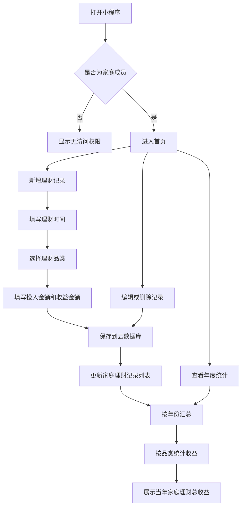

# 家庭理财收益统计小程序运行流程图

```mermaid
flowchart TD
    A[打开小程序] --> B{是否为家庭成员}
    B -- 否 --> C[显示无访问权限]
    B -- 是 --> D[进入首页]

    D --> E[新增理财记录]
    E --> F[填写理财时间]
    F --> G[选择理财品类]
    G --> H[填写投入金额和收益金额]
    H --> I[保存到云数据库]

    I --> J[更新家庭理财记录列表]
    J --> K[按年份汇总]
    K --> L[按品类统计收益]
    L --> M[展示当年家庭理财总收益]

    D --> N[查看年度统计]
    N --> K

    D --> O[编辑或删除记录]
    O --> I
```

## 主要数据

- 理财时间
- 理财品类
- 投入金额
- 收益金额
- 记录人
- 备注

## 主要统计

- 当年家庭理财总收益
- 各品类收益占比
- 每月收益趋势
- 每位家庭成员记录汇总
